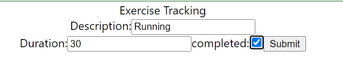
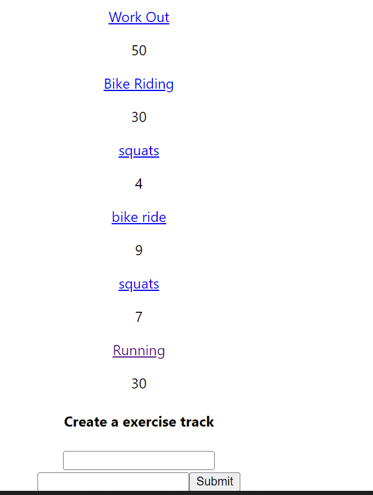
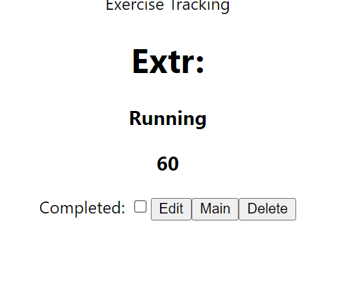

# EXERCISE-TRACKING APP

## FRONTEND using REACT

This is  frontend app named exercise-tracker system.Can add edit and delete Exercises, duration of exercise and users
This project was bootstrapped with [Create React App](https://github.com/ektapass/exercise-react.git).

[Live site](https://exercise-react-ui.onrender.com)

### Technologies Used
* React

### How to install dependencies

In terminal, run ..

* npx create-react-app app-name
* npm i axios

### Screenshots

## How to run 

In the project directory, you can run:

### `npm start`

Runs the app in the development mode.\
Open [http://localhost:3000](http://localhost:3000) to view it in your browser.

The page will reload when you make changes.\
You may also see any lint errors in the console.

### Future Plan

Plan to work on improving user interface like more fields and add more functionalities.

## Learn More

You can learn more in the [Create React App documentation](https://facebook.github.io/create-react-app/docs/getting-started).

To learn React, check out the [React documentation](https://reactjs.org/).

### Code Splitting

This section has moved here: [https://facebook.github.io/create-react-app/docs/code-splitting](https://facebook.github.io/create-react-app/docs/code-splitting)
 

### Deployment

This section has moved here: [https://facebook.github.io/create-react-app/docs/deployment](https://facebook.github.io/create-react-app/docs/deployment)

### `npm run build` fails to minify

This section has moved here: [https://facebook.github.io/create-react-app/docs/troubleshooting#npm-run-build-fails-to-minify](https://facebook.github.io/create-react-app/docs/troubleshooting#npm-run-build-fails-to-minify)

### ACknowledgement:
Special Thanks to my instructors **Tishana Trainor** and

 **Kasper Kain**and my classmate  **Gary Newton**

&copy; Ekta Bharti